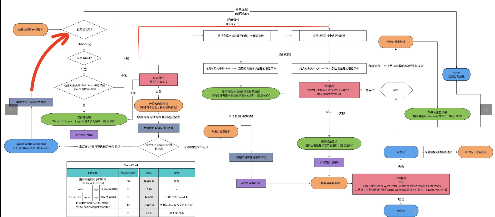

# JUC

[TOC]

```
java代码 -> java字节码 -> jvm ->汇编指令
java 并发依赖于 jvm 实现和 cpu的指令
```


## 1.volatile

### cpu处理

```
对 volatile 变量进行写操作  汇编指令 加上 lock 前缀
lock 在多核处理器下处理
1.将当前缓存行数据写会到系统内存（缓存锁定，阻止同时修改两个以上处理器缓存的内存数据区域）
2.缓存行数据写回操作会使其他核心缓存了该内存地址数据无效（ MESI 修改、独占、共享、无效 ）
```

### 优化

```
适合共享变量被频繁写
缓存行填充（java7以后淘汰或重新排列无用字段）
增加占位数据填充缓存行读取字节
空间换时间，对象大小增加，影响内存、gc
```

## 2.synchronized

```
每一个对象都可以作为锁
普通同步方法   锁实例 ACC_SYNCHRONIZED
静态方法      锁class
同步方法块    锁括号里配置对象
锁存储在对象头（markword+类型指针+数组长度）
```

### Monitor 

```
jvm 基于进入和退出 monitor 实现方法同步和代码块同步
代码块同步 monitorenter monitorexit
任何对象都有 一个monitor与之关联
当且一个monitor被持有后，它将处于锁定状态
线程执行到monitorenter 指令时，将会尝试获取对象所对应的monitor的所有权，即尝试获得对象的锁。
```

### 锁升级

```
锁状态
无锁状态 -> 偏向锁状态 -> 轻量级锁状态 -> 重量级锁状态 可以升级 不能降级（降级在gc 已经无意义）
```

### 偏向锁

```
大多数情况下是不存在多线程竞争，偏向锁是为了让单个线程获得锁的代价更低
当一个线程访问同步块获取锁时，会在 markword 和栈帧的锁记录存储偏向的线程id
以后改线程在进入和退出同步块不再需要 CAS 来加锁解锁
```

#### 偏向锁获取

```
1.测试 markword 偏向锁是否存储当前线程id
2.如果成功，线程已经获取锁
如果失败
	测试 对象头 中的偏向锁标示是否设置为1（标示是偏向锁）
		如果没有设置为偏向锁， CAS 竞争锁
		如果已经设置为偏向锁， 尝试使用 CAS 将 markword 中的偏向锁指向当前线程(线程id)
```

```
（1）访问Mark Word中偏向锁标志位是否设置成1，锁标志位是否为01——确认为可偏向状态。
（2）如果为可偏向状态，则测试线程ID是否指向当前线程，如果是，进入步骤（5），否则进入步骤（3）。
（3）如果线程ID并未指向当前线程，则通过CAS操作竞争锁。如果竞争成功，则将Mark Word中线程ID设置为当前线程ID，			然后执行（5）；如果竞争失败，执行（4）。
（4）如果CAS获取偏向锁失败，则表示有竞争。当到达全局安全点（safepoint）时获得偏向锁的线程被挂起，偏向锁升级		为轻量级锁，然后被阻塞在安全点的线程继续往下执行同步代码。
（5）执行同步代码。
```

#### 偏向锁撤销

```
偏向锁采用一种等到竞争出现才释放锁的机制
当其他线程尝试竞争偏向锁，持有偏向锁的线程才会释放锁
```

```
偏向锁的撤销需要等待全局安全点（在这个时间点上没有正在执行的字节码）
safepoint(所有线程都是暂停的一个状态)
1.暂停拥有偏向锁的线程
2.检查持有偏向锁的线程是否存活
		线程不活跃 将对象头设置为无锁状态
		线程存活 拥有偏向锁的栈执行
			 遍历偏向对象的锁记录	
			 栈中锁记录和markword 要么重新偏向其他线程
			 要么恢复到无锁或者标记对象不适合作为偏向锁
3.唤醒暂停的线程
```

```
1：A 线程已经退出了同步代码块，或者是已经不在存活了，如果是上面两种情况之一的，此时就会直接
	撤销偏向锁，变成无锁状态。
2: A 线程还在同步代码块中，此时将 A 线程的偏向锁升级为轻量级锁。具体怎么升级的看下面的偏向锁
	升级轻量级锁的过程。
```

#### 批量重偏向

```
当只有一个线程反复进入同步块时，偏向锁带来的性能开销基本可以忽略
但是当有其他线程尝试获得锁时，就需要等到safe point时将偏向锁撤销为无锁状态或升级为轻量级/重量级锁
这个过程是要消耗一定的成本的，所以如果说运行时的场景本身存在多线程竞争的
那偏向锁的存在不仅不能提高性能，而且会导致性能下降
因此，JVM中增加了一种批量重偏向/撤销的机制。
```

#### 批量重偏向原理

```
1.首先引入一个概念epoch，其本质是一个时间戳，代表了偏向锁的有效性，存储在可偏向对象的MarkWord中。
	除了对象中的epoch,对象所属的类class信息中，也会保存一个epoch值。

2.每当遇到一个全局安全点时(这里的意思是说批量重偏向没有完全替代了全局安全点，全局安全点是一直存在的)
  比如要对class C 进行批量再偏向，则首先对 class C中保存的epoch进行增加操作，得到一个新的epoch_new

3.然后扫描所有持有 class C 实例的线程栈，根据线程栈的信息判断出该线程是否锁定了该对象
  仅将epoch_new的值赋给被锁定的对象中，也就是现在偏向锁还在被使用的对象才会被赋值epoch_new。

4.退出安全点后，当有线程需要尝试获取偏向锁时
  直接检查 class C 中存储的 epoch 值是否与目标对象中存储的 epoch 值相等，
  如果不相等，则说明该对象的偏向锁已经无效了（
  因为（3）步骤里面已经说了只有偏向锁还在被使用的对象才会有epoch_new
  这里不相等的原因是class C里面的epoch值是epoch_new
  而当前对象的epoch里面的值还是epoch）
  此时竞争线程可以尝试对此对象重新进行偏向操作。
```

#### 关闭偏向锁

```
偏向锁在 java6、java7 里默认是启用的，在应用程序启动几秒钟之后才激活
关闭延迟      -XX:BiasedLockingStartupDelay=0
默认         -XX:+UseBiaseLocking
关闭偏向锁锁  -XX:-UseBiaseLocking 
```

### 轻量级锁

```
CAS  线程去改 markword ，将自己栈空间锁记录指针写上去
自旋消耗CPU
膨胀为重量级锁 进入阻塞队列 
jdk6 -XX:PreBlockSpin 默认自旋10次 自适应自旋 重试机制 jvm 控制
```

#### 轻量级加锁

```
1.线程在执行同步块之前，jvm 会在当前线程的栈帧中创建用于存储锁记录的空间（lock record）
2.将对象头中的 markword 复制到锁记录中（displaced mark word）
3.线程尝试使用 CAS 将 markword 替换为指向锁记录（lock record）的指针 
	如果成功 线程获取锁 栈帧（displaced hdr == markword owner指向markword）
	如果失败
		检查对象的 mark word 是否指向当前线程的栈帧
			是就直接执行同步块
			否则就是锁对象被其他线程抢占了
	如果两个以上的线程争用一个锁，轻量级锁就不再有效，要膨胀为重量级锁
	markword 存储就是重量级锁(互斥量)的指针，后面的线程也要进入阻塞状态
```

#### 轻量级锁解锁

```
1.使用 CAS 将 Displace Mark Word 和 markword 替换
	如果成功 整个同步过程就完成
	如果失败 说明有其他线程尝试过获取该锁，那就要在释放的同时，唤醒被挂起的线程
```

### 总结



```
重量级锁，会直接向操作系统申请资源，将等待线程挂起，进入锁池队列阻塞等待，等待操作系统的调度。
其余的偏向锁和轻量级锁，本质上并未交由操作系统调度，依然处于用户态，依然消耗CPU资源
只是采用CAS无锁竞争的方式获取锁。CAS又是Java通过Unsafe类中compareAndSwap方法
jni调用jvm中的C++方法，最终通过下述汇编指令锁住cpu中的北桥信号（非锁住总线，锁住总线就什么都干不了了）实现。
lock cmpxchg
```

### Sync & lock

```
 在高争用 高耗时的环境下synchronized效率更高
 在低争用 低耗时的环境下CAS效率更高
 synchronized到重量级之后是等待队列（不消耗CPU）
 CAS（等待期间消耗CPU）
```

### 锁消除

```
锁消除是指虚拟机即时编译器在运行时，对一些代码要求同步，但是对被检测到不可能存在共享数据竞争的锁进行消除。
锁消除的主要判定依据来源于逃逸分析的数据支持，如果判断到一段代码中，在堆上的所有数据都不会逃逸出去被其他线程调用，那就可以把它们当作栈上数据对待，认为它们是线程私有的，同步加锁自然无须再进行。
```


```java
public void add(String str1,String str2){
         StringBuffer sb = new StringBuffer();
         sb.append(str1).append(str2);
}
```

```
我们都知道 StringBuffer 是线程安全的，因为它的关键方法都是被 synchronized 修饰过的，但我们看上面这段代码，我们会发现，sb 这个引用只会在 add 方法中使用，不可能被其它线程引用（因为是局部变量，栈私有），因此 sb 是不可能共享的资源，JVM 会自动消除 StringBuffer 对象内部的锁。
```

### 锁粗化

```
public String test(String str){
       
       int i = 0;
       StringBuffer sb = new StringBuffer():
       while(i < 100){
           sb.append(str);
           i++;
       }
       return sb.toString():
}
```

```
JVM 会检测到这样一连串的操作都对同一个对象加锁（while 循环内 100 次执行 append，没有锁粗化的就要进行 100  次加锁/解锁），此时 JVM 就会将加锁的范围粗化到这一连串的操作的外部（比如 while 虚幻体外），使得这一连串操作只需要加一次锁即可。
```

### 编译器优化


## 3.hashcode

Identity hashcode

Markword hashcode位置


## 4.原子操作

### 内存顺序冲突

```
假共享
多个 cpu 同时修改一个缓存行的不同部分引起其中一个 cpu 操作无效
出现内存顺序冲突的时候，cpu 必须清空流水线
```

### 处理器实现

```
缓存加锁 缓存锁定｜总线锁定
保证从系统内存中读写改一个字节是原子的，其他处理器不能访问地址
```

#### 锁总线

```
使用处理器提供的 lock# 信号，当一个处理器在总线输出此信号时，其他处理器的请求将被阻塞住，保证此处理器可以独占共享内存
```

#### 锁缓存

```
锁总线开销比较大
内存区域如果被缓存在处理器的缓存行中，并且在 lock 操作器件被锁定
当执行锁操作会写到内存时,处理器不再总线声言 lock 信号
而是修改内部的内存地址，并允许他的缓存一致性机制来保证操作的原子性
通过缓存一致性阻止同时修改由两个以上处理器缓存的内存区域数据，让缓存行失效
```

#### 锁缓存特殊情况

```
操作的数据不能被缓存在处理器内部，或者操作的数据跨多个缓存行，处理器会调用总线锁定
```

```
处理器不支持缓存锁定
```

#### Java实现

**锁｜循环 CAS**

##### CAS 问题

- ABA

  你的女朋友和你分手了又回来了

  加版本号 AtomicStampedReference ( ordObj，newObj，oldVersion，newVersion )

- 循环时间长开销大

  长时间自旋 cpu 开销比较大

  处理器指令 pause 支持 延迟流水线执行指令、可以避免在退出循环的时候因内存顺序冲突引起 cpu 流水线清空

- 只能保证一个共享变量的原子操作

  jdk 提供 AtomicReference 保证引用对象之间原子性 

##### 锁实现

除了互斥锁，jvm 实现锁都要进行循环 CAS

## 5.内存模型

**线程共享堆内存（实例数据，静态数据，数组元素），内存可见性受内存模型影响**

```
Java线程之间的通信由Java内存模型(JMM)控制，JMM决定一个线程对共享变量的写入何时对另一个线程可见。
从抽象的角度来看，JMM定义了线程和主内存之间的抽象关系:
线程之间的共享变量存储在主内存(Main Memory)中
每个线程都有一个私有的本地 内存(Local Memory)
本地内存中存储了该线程以读/写共享变量的副本
```

**JMM通过控制主内存与每个线程的本地内存之间的交互，来为Java程序员提供 内存可见性保证**

### 重排序

- 编译器优化重排序

  **编译器不改变单线程程序语义前提下，可以重新安排语句的执行顺序**

- 指令级并行重排序

  **处理器指令并行技术将多条指令重叠执行，不存在数据依赖性可以改变语句对应及其执行的执行顺序**

- 内存系统重排序

  **内存系统使用缓存和读缓冲区，加载和存储看上去可能是在乱序执行**

**源代码到最终执行的指令序列重排序**

源代码 ->1. 编译器优化重排序 -> 2.指令级并行重排序 ->3.内存系统重排序 -> 最终执行的指令序列

JMM 通过禁止特定类型的编译器重排序和处理器重排序（通过要求编译器在生成指令序列时，插入特定类型的内存屏障指令）提供一致性内存可见性

### 内存屏障

**jvm 编译器生成指令序列适当位置插入内存屏障指令来禁止特定类型的处理器重排序**

- LoadLoad Barries

  Load1;loadload;load2 

  确保 load1 数据的装载先于 load2 及所有后续装载指令的装载

- StoreStore Barries

  Store1;StoreStore;Store2 

  确保 Store1 数据对其他处理器可见 （刷新到内存）先于 Store2 及所有后续存储指令的存储

- LoadStore Barries

  Load1;LoadSttore;Store2

  确保 load1 数据装载先于 Store2 及所有后续的存储指令刷新到内存 

- StoreStore Barries

  Store1;StoreLoad;Load2 

  确保Store1 数据对其他处理器变得可见（刷新到内存）先于 Load2 及所有后续装载指令的装载

  StoreLoad Barries 会使该屏障之前的所有内存访问指令（存储和装载指令）完成之后，才执行该屏障之后的内存访问指令

### Happens-before(TODO)

**jdk5，使用新的 JSR-133内存模型，使用 happen-before 概念阐述操作之间的内存可见性**

```
在 JMM 中，如果一个操作执行的结果需要对另一个操作可见，这两个操作之间也必须要存在 happen-before 关系
两个操作可以是在一个线程内，也可以在不同线程之间
```

#### 规则

- 程序顺序规则 

  **一个线程中的每个操作，happen-before 于该线程中的任意后续操作**

- 监视器规则

  **对一个锁的解锁，hanppens-before 于随后这个锁的加锁**

- volatile变量规则

  **对一个 volatile 域的写，happens-before 于任意后续对这个 volatile 域的读**

- 传递性

```
两个操作之间具有happens-before关系，并不意味着前一个操作必须要在后一个操作之前执行!
happens-before仅仅要求前一个操作(执行的结果)对后一个操作可见
且前一个操作按顺序排在第二个操作之前(the first is visible to and ordered before the second)

what the fuck
```

### 数据依赖性

如果两个操作操作同一个变量，一个写，一个读，这两个操作之间就存在数据依赖性

**不同处理器和不同线程之间的数据依赖性不被编译器和处理器考虑**

### as-if-serial

**不管怎么重排序，单线程程序的执行结果不能被改变，编译器，runtime和处理器都必须遵守 as-if-serial语义**

## 6.线程

### 状态


```
线程创建之后，调用start()方法开始运行。
当线程执行wait()方法之 后，线程进入等待状态。
进入等待状态的线程需要依靠其他线程的通知才能够返回到运行状态
超时等待状态相当于在等待状态的基础上增加了超时限制，也就是超时时间到达时将 会返回到运行状态
当线程调用同步方法时，在没有获取到锁的情况下，线程将会进入到阻塞状态
线程在执行Runnable的run()方法之后将会进入到终止状态
```

```
Java将操作系统中的运行和就绪两个状态合并称为运行状态
阻塞状态是线程阻塞在进入synchronized关键字修饰的方法或代码块(获取锁)时的状态
但是阻塞在 java.concurrent包中Lock接口的线程状态却是等待状态
因为java.concurrent包中Lock接口对于阻塞的实现均使用了LockSupport类中的相关方法
```

### Daemon

```
支持型线程，主要被用在程序中后台调度以及支持性工作
当虚拟机中不存在非 Daemon 线程的时候，虚拟机退出
通过提前调用 Thread.setDaemon(true) 将线程设置为 Daemon 线程，⚠️ finally 里面不会执行，因为虚拟机退出了
```

### 中断

```
sleep 会清除中断标志位 
```

### 线程间通信

```
volatile 主要是可见性 synchronized 排它
```


