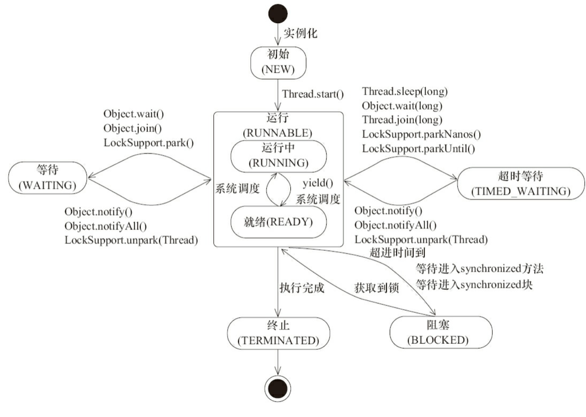
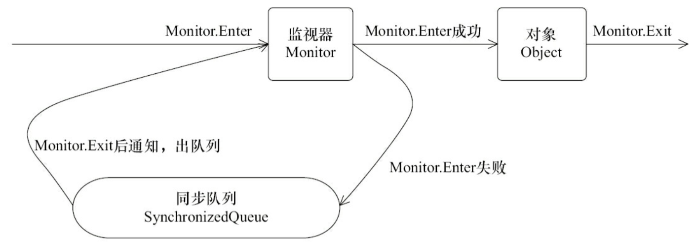
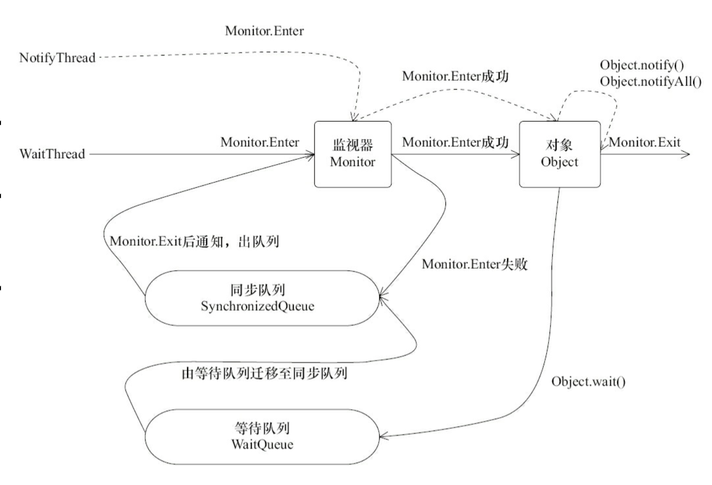
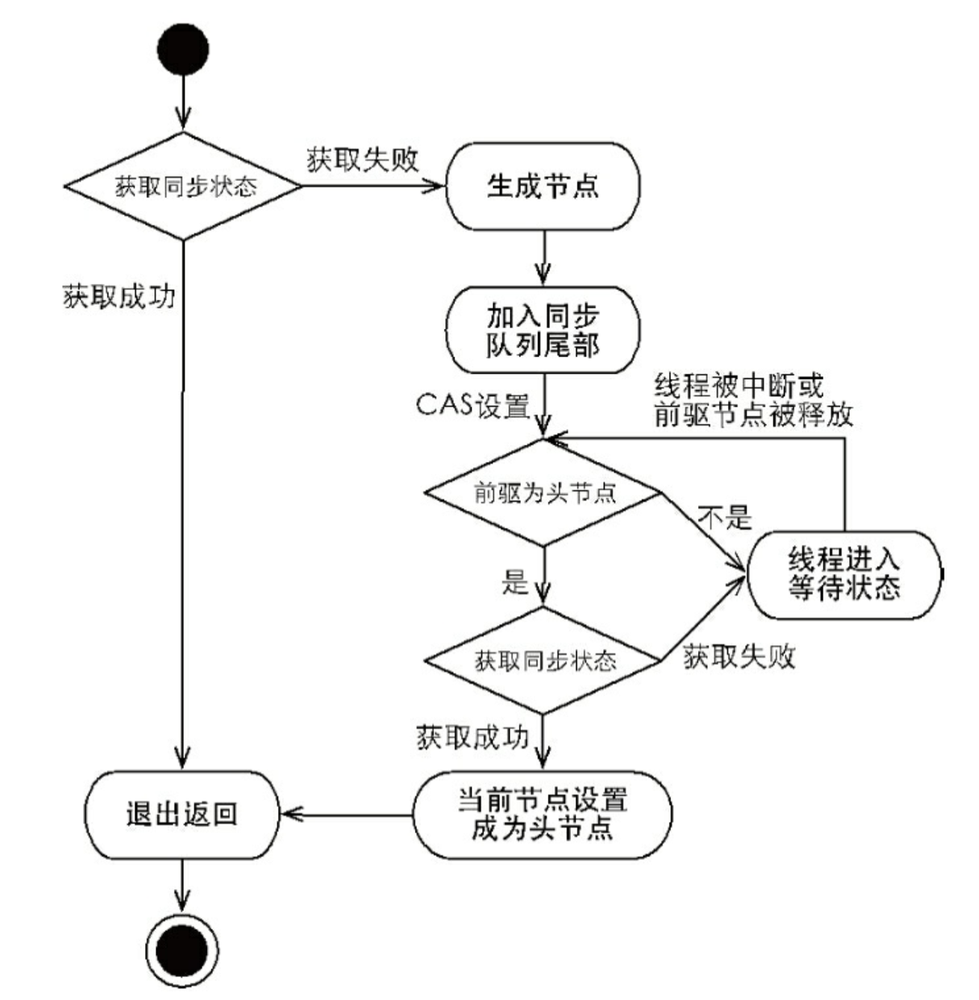
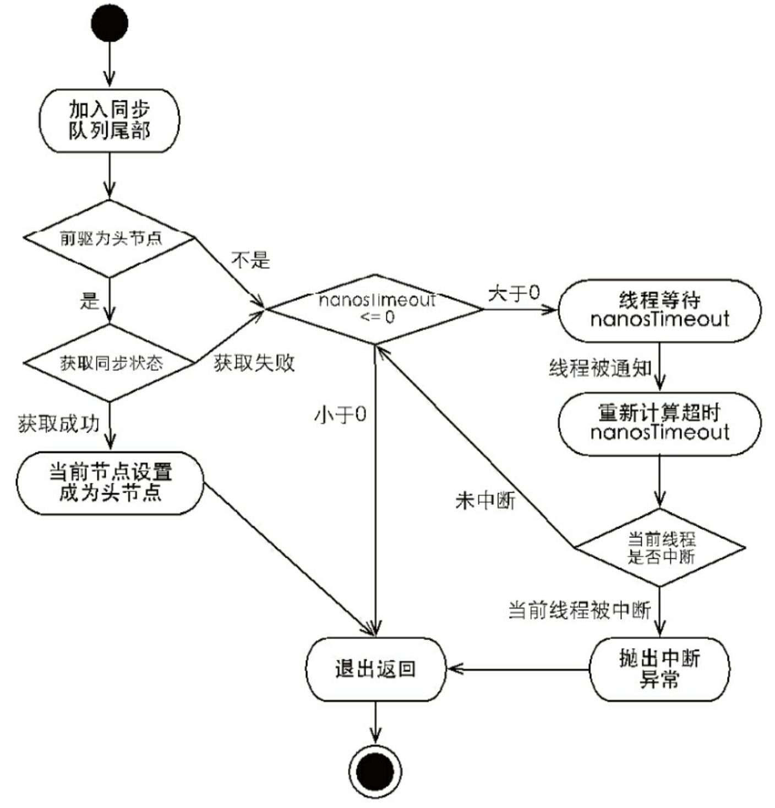
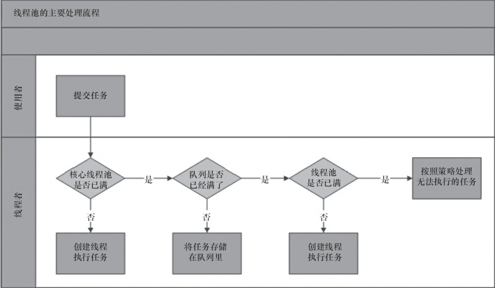
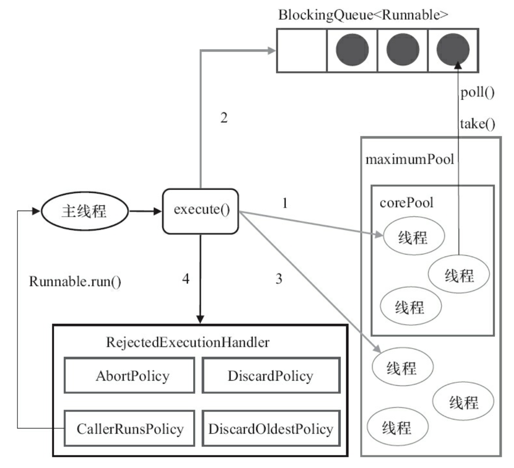

# JUC

[TOC]

```
java代码 -> java字节码 -> jvm ->汇编指令
java 并发依赖于 jvm 实现和 cpu的指令
```


## 1.volatile

### cpu处理

```
对 volatile 变量进行写操作  汇编指令 加上 lock 前缀
lock 在多核处理器下处理
1.将当前缓存行数据写会到系统内存（缓存锁定，阻止同时修改两个以上处理器缓存的内存数据区域）
2.缓存行数据写回操作会使其他核心缓存了该内存地址数据无效（ MESI 修改、独占、共享、无效 ）
```

### 优化

```
适合共享变量被频繁写
缓存行填充（java7以后淘汰或重新排列无用字段）
增加占位数据填充缓存行读取字节
空间换时间，对象大小增加，影响内存、gc
```

#### 总线风暴

```
大量使用 volatile 会频繁访问总线和锁部分缓存以及进行同步失效
总线压力大
可以和 sync 搭配使用
```


## 2.synchronized

```
每一个对象都可以作为锁
普通同步方法   锁实例 ACC_SYNCHRONIZED
静态方法      锁class
同步方法块    锁括号里配置对象
锁存储在对象头（markword+类型指针+数组长度）
```

### Monitor 

```
jvm 基于进入和退出 monitor 实现方法同步和代码块同步
代码块同步 monitorenter monitorexit
任何对象都有 一个monitor与之关联
当且一个monitor被持有后，它将处于锁定状态
线程执行到monitorenter 指令时，将会尝试获取对象所对应的monitor的所有权，即尝试获得对象的锁。
```

### 锁升级

```
锁状态
无锁状态 -> 偏向锁状态 -> 轻量级锁状态 -> 重量级锁状态 可以升级 不能降级（降级在gc 已经无意义）
```

### 偏向锁

```
大多数情况下是不存在多线程竞争，偏向锁是为了让单个线程获得锁的代价更低
当一个线程访问同步块获取锁时，会在 markword 和栈帧的锁记录存储偏向的线程id
以后改线程在进入和退出同步块不再需要 CAS 来加锁解锁
```

#### 偏向锁获取

```
1.测试 markword 偏向锁是否存储当前线程id
2.如果成功，线程已经获取锁
如果失败
	测试 对象头 中的偏向锁标示是否设置为1（标示是偏向锁）
		如果没有设置为偏向锁， CAS 竞争锁
		如果已经设置为偏向锁， 尝试使用 CAS 将 markword 中的偏向锁指向当前线程(线程id)
```

```
（1）访问Mark Word中偏向锁标志位是否设置成1，锁标志位是否为01——确认为可偏向状态。
（2）如果为可偏向状态，则测试线程ID是否指向当前线程，如果是，进入步骤（5），否则进入步骤（3）。
（3）如果线程ID并未指向当前线程，则通过CAS操作竞争锁。如果竞争成功，则将Mark Word中线程ID设置为当前线程ID，			然后执行（5）；如果竞争失败，执行（4）。
（4）如果CAS获取偏向锁失败，则表示有竞争。当到达全局安全点（safepoint）时获得偏向锁的线程被挂起，偏向锁升级		为轻量级锁，然后被阻塞在安全点的线程继续往下执行同步代码。
（5）执行同步代码。
```

#### 偏向锁撤销

```
偏向锁采用一种等到竞争出现才释放锁的机制
当其他线程尝试竞争偏向锁，持有偏向锁的线程才会释放锁
```

```
偏向锁的撤销需要等待全局安全点（在这个时间点上没有正在执行的字节码）
safepoint(所有线程都是暂停的一个状态)
1.暂停拥有偏向锁的线程
2.检查持有偏向锁的线程是否存活
		线程不活跃 将对象头设置为无锁状态
		线程存活 拥有偏向锁的栈执行
			 遍历偏向对象的锁记录	
			 栈中锁记录和markword 要么重新偏向其他线程
			 要么恢复到无锁或者标记对象不适合作为偏向锁
3.唤醒暂停的线程
```

```
1：A 线程已经退出了同步代码块，或者是已经不在存活了，如果是上面两种情况之一的，此时就会直接
	撤销偏向锁，变成无锁状态。
2: A 线程还在同步代码块中，此时将 A 线程的偏向锁升级为轻量级锁。具体怎么升级的看下面的偏向锁
	升级轻量级锁的过程。
```

#### 批量重偏向

```
当只有一个线程反复进入同步块时，偏向锁带来的性能开销基本可以忽略
但是当有其他线程尝试获得锁时，就需要等到safe point时将偏向锁撤销为无锁状态或升级为轻量级/重量级锁
这个过程是要消耗一定的成本的，所以如果说运行时的场景本身存在多线程竞争的
那偏向锁的存在不仅不能提高性能，而且会导致性能下降
因此，JVM中增加了一种批量重偏向/撤销的机制。
```

#### 批量重偏向原理

```
1.首先引入一个概念epoch，其本质是一个时间戳，代表了偏向锁的有效性，存储在可偏向对象的MarkWord中。
	除了对象中的epoch,对象所属的类class信息中，也会保存一个epoch值。

2.每当遇到一个全局安全点时(这里的意思是说批量重偏向没有完全替代了全局安全点，全局安全点是一直存在的)
  比如要对class C 进行批量再偏向，则首先对 class C中保存的epoch进行增加操作，得到一个新的epoch_new

3.然后扫描所有持有 class C 实例的线程栈，根据线程栈的信息判断出该线程是否锁定了该对象
  仅将epoch_new的值赋给被锁定的对象中，也就是现在偏向锁还在被使用的对象才会被赋值epoch_new。

4.退出安全点后，当有线程需要尝试获取偏向锁时
  直接检查 class C 中存储的 epoch 值是否与目标对象中存储的 epoch 值相等，
  如果不相等，则说明该对象的偏向锁已经无效了（
  因为（3）步骤里面已经说了只有偏向锁还在被使用的对象才会有epoch_new
  这里不相等的原因是class C里面的epoch值是epoch_new
  而当前对象的epoch里面的值还是epoch）
  此时竞争线程可以尝试对此对象重新进行偏向操作。
```

#### 关闭偏向锁

```
偏向锁在 java6、java7 里默认是启用的，在应用程序启动几秒钟之后才激活
关闭延迟      -XX:BiasedLockingStartupDelay=0
默认         -XX:+UseBiaseLocking
关闭偏向锁锁  -XX:-UseBiaseLocking 
```

### 轻量级锁

```
CAS  线程去改 markword ，将自己栈空间锁记录指针写上去
自旋消耗CPU
膨胀为重量级锁 进入阻塞队列 
jdk6 -XX:PreBlockSpin 默认自旋10次 自适应自旋 重试机制 jvm 控制
```

#### 轻量级加锁

```
1.线程在执行同步块之前，jvm 会在当前线程的栈帧中创建用于存储锁记录的空间（lock record）
2.将对象头中的 markword 复制到锁记录中（displaced mark word）
3.线程尝试使用 CAS 将 markword 替换为指向锁记录（lock record）的指针 
	如果成功 线程获取锁 栈帧（displaced hdr == markword owner指向markword）
	如果失败
		检查对象的 mark word 是否指向当前线程的栈帧
			是就直接执行同步块
			否则就是锁对象被其他线程抢占了
	如果两个以上的线程争用一个锁，轻量级锁就不再有效，要膨胀为重量级锁
	markword 存储就是重量级锁(互斥量)的指针，后面的线程也要进入阻塞状态
```

#### 轻量级锁解锁

```
1.使用 CAS 将 Displace Mark Word 和 markword 替换
	如果成功 整个同步过程就完成
	如果失败 说明有其他线程尝试过获取该锁，那就要在释放的同时，唤醒被挂起的线程
```

### 总结


```
重量级锁，会直接向操作系统申请资源，将等待线程挂起，进入锁池队列阻塞等待，等待操作系统的调度。
其余的偏向锁和轻量级锁，本质上并未交由操作系统调度，依然处于用户态，依然消耗CPU资源
只是采用CAS无锁竞争的方式获取锁。CAS又是Java通过Unsafe类中compareAndSwap方法
jni调用jvm中的C++方法，最终通过下述汇编指令锁住cpu中的北桥信号（非锁住总线，锁住总线就什么都干不了了）实现。
lock cmpxchg
```

### Sync & lock

```
 在高争用 高耗时的环境下synchronized效率更高
 在低争用 低耗时的环境下CAS效率更高
 synchronized到重量级之后是等待队列（不消耗CPU）
 CAS（等待期间消耗CPU）
```

### 锁消除

```
锁消除是指虚拟机即时编译器在运行时，对一些代码要求同步，但是对被检测到不可能存在共享数据竞争的锁进行消除。
锁消除的主要判定依据来源于逃逸分析的数据支持，如果判断到一段代码中，在堆上的所有数据都不会逃逸出去被其他线程调用，那就可以把它们当作栈上数据对待，认为它们是线程私有的，同步加锁自然无须再进行。
```


```java
public void add(String str1,String str2){
         StringBuffer sb = new StringBuffer();
         sb.append(str1).append(str2);
}
```

```
我们都知道 StringBuffer 是线程安全的，因为它的关键方法都是被 synchronized 修饰过的，但我们看上面这段代码，我们会发现，sb 这个引用只会在 add 方法中使用，不可能被其它线程引用（因为是局部变量，栈私有），因此 sb 是不可能共享的资源，JVM 会自动消除 StringBuffer 对象内部的锁。
```

### 锁粗化

```
public String test(String str){
       
       int i = 0;
       StringBuffer sb = new StringBuffer():
       while(i < 100){
           sb.append(str);
           i++;
       }
       return sb.toString():
}
```

```
JVM 会检测到这样一连串的操作都对同一个对象加锁（while 循环内 100 次执行 append，没有锁粗化的就要进行 100  次加锁/解锁），此时 JVM 就会将加锁的范围粗化到这一连串的操作的外部（比如 while 虚幻体外），使得这一连串操作只需要加一次锁即可。
```

### 编译器优化


## 3.hashcode

Identity hashcode

Markword hashcode位置


## 4.原子操作

### 内存顺序冲突

```
假共享
多个 cpu 同时修改一个缓存行的不同部分引起其中一个 cpu 操作无效
出现内存顺序冲突的时候，cpu 必须清空流水线
```

### 处理器实现

```
缓存加锁 缓存锁定｜总线锁定
保证从系统内存中读写改一个字节是原子的，其他处理器不能访问地址
```

#### 锁总线

```
使用处理器提供的 lock# 信号，当一个处理器在总线输出此信号时，其他处理器的请求将被阻塞住，保证此处理器可以独占共享内存
```

#### 锁缓存

```
锁总线开销比较大
内存区域如果被缓存在处理器的缓存行中，并且在 lock 操作器件被锁定
当执行锁操作会写到内存时,处理器不再总线声言 lock 信号
而是修改内部的内存地址，并允许他的缓存一致性机制来保证操作的原子性
通过缓存一致性阻止同时修改由两个以上处理器缓存的内存区域数据，让缓存行失效
```

#### 锁缓存特殊情况

```
操作的数据不能被缓存在处理器内部，或者操作的数据跨多个缓存行，处理器会调用总线锁定
```

```
处理器不支持缓存锁定
```

#### Java实现

**锁｜循环 CAS**

##### CAS 问题

- ABA

  你的女朋友和你分手了又回来了

  加版本号 AtomicStampedReference ( ordObj，newObj，oldVersion，newVersion )

- 循环时间长开销大

  长时间自旋 cpu 开销比较大

  处理器指令 pause 支持 延迟流水线执行指令、可以避免在退出循环的时候因内存顺序冲突引起 cpu 流水线清空

- 只能保证一个共享变量的原子操作

  jdk 提供 AtomicReference 保证引用对象之间原子性 

##### 锁实现

除了互斥锁，jvm 实现锁都要进行循环 CAS

## 5.内存模型

**线程共享堆内存（实例数据，静态数据，数组元素），内存可见性受内存模型影响**

```
Java线程之间的通信由Java内存模型(JMM)控制，JMM决定一个线程对共享变量的写入何时对另一个线程可见。
从抽象的角度来看，JMM定义了线程和主内存之间的抽象关系:
线程之间的共享变量存储在主内存(Main Memory)中
每个线程都有一个私有的本地 内存(Local Memory)
本地内存中存储了该线程以读/写共享变量的副本
```

**JMM通过控制主内存与每个线程的本地内存之间的交互，来为Java程序员提供 内存可见性保证**

### 重排序

- 编译器优化重排序

  **编译器不改变单线程程序语义前提下，可以重新安排语句的执行顺序**

- 指令级并行重排序

  **处理器指令并行技术将多条指令重叠执行，不存在数据依赖性可以改变语句对应及其执行的执行顺序**

- 内存系统重排序

  **内存系统使用缓存和读缓冲区，加载和存储看上去可能是在乱序执行**

**源代码到最终执行的指令序列重排序**

源代码 ->1. 编译器优化重排序 -> 2.指令级并行重排序 ->3.内存系统重排序 -> 最终执行的指令序列

JMM 通过禁止特定类型的编译器重排序和处理器重排序（通过要求编译器在生成指令序列时，插入特定类型的内存屏障指令）提供一致性内存可见性

### 内存屏障

**jvm 编译器生成指令序列适当位置插入内存屏障指令来禁止特定类型的处理器重排序**

- LoadLoad Barries

  Load1;loadload;load2 

  确保 load1 数据的装载先于 load2 及所有后续装载指令的装载

- StoreStore Barries

  Store1;StoreStore;Store2 

  确保 Store1 数据对其他处理器可见 （刷新到内存）先于 Store2 及所有后续存储指令的存储

- LoadStore Barries

  Load1;LoadSttore;Store2

  确保 load1 数据装载先于 Store2 及所有后续的存储指令刷新到内存 

- StoreStore Barries

  Store1;StoreLoad;Load2 

  确保Store1 数据对其他处理器变得可见（刷新到内存）先于 Load2 及所有后续装载指令的装载

  StoreLoad Barries 会使该屏障之前的所有内存访问指令（存储和装载指令）完成之后，才执行该屏障之后的内存访问指令

### Happens-before(TODO)

**jdk5，使用新的 JSR-133内存模型，使用 happen-before 概念阐述操作之间的内存可见性**

```
在 JMM 中，如果一个操作执行的结果需要对另一个操作可见，这两个操作之间也必须要存在 happen-before 关系
两个操作可以是在一个线程内，也可以在不同线程之间
```

#### 规则

- 程序顺序规则 

  **一个线程中的每个操作，happen-before 于该线程中的任意后续操作**

- 监视器规则

  **对一个锁的解锁，hanppens-before 于随后这个锁的加锁**

- volatile变量规则

  **对一个 volatile 域的写，happens-before 于任意后续对这个 volatile 域的读**

- 传递性

```
两个操作之间具有happens-before关系，并不意味着前一个操作必须要在后一个操作之前执行!
happens-before仅仅要求前一个操作(执行的结果)对后一个操作可见
且前一个操作按顺序排在第二个操作之前(the first is visible to and ordered before the second)

what the fuck
```

### 数据依赖性

如果两个操作操作同一个变量，一个写，一个读，这两个操作之间就存在数据依赖性

**不同处理器和不同线程之间的数据依赖性不被编译器和处理器考虑**

### as-if-serial

**不管怎么重排序，单线程程序的执行结果不能被改变，编译器，runtime和处理器都必须遵守 as-if-serial语义**


### 双重检查锁

```java
/**
 * Double check lock
 * intra-thread semantics 规范保证单线程重排序不会改变结果
 * @author lgc
 */
public class SafeDoubleCheckBlocking {
    private static volatile Instance instance;

    public static Instance GetInstance() {
        if (instance == null) {
            synchronized (SafeDoubleCheckBlocking.class) {
                if (instance != null) { //此处可能单线程重排序 @1
                    /**
                     * 线程 A
                     *  1.分配内存空间
                     *  2.设置 instance 指向 内存空间  线程 B @1 处判断是否为空 不为空 访问一个没有初始化的 instance
                     *  3.初始化 instance
                     *  4.线程A初次访问 instance
                     *  解决方案
                     *  1.不允许 2 3 重排序 volatile jdk1.5 采用 jsr 133内存模型规范 增强了 volatile
                     *  2.允许 2 3 重排序 不允许其他线程看到重排序
                     */
                    return new Instance();
                }
            }
        }
        return instance;
    }

    static class Instance {

    }
}
```

```java
/**
 * class 被 jvm 加载 在线程使用之前会执行初始化
 * 在执行初始化期间, jvm 会获取一个锁 这个锁会同步多线程对同一个类的初始化
 * 即时发生了重排序 其他线程同步看不到
 *
 * 初始化一个类，包括执行这个类的静态初始化和初始化在这个类中声明的静态字段。
 * 根据Java语言规范，在首次发生下列任意一种情况时，一个类或接口类型T将被立即初始化。
 * 1)T是一个类，而且一个T类型的实例被创建。
 * 2)T是一个类，且T中声明的一个静态方法被调用。
 * 3)T中声明的一个静态字段被赋值。
 * 4)T中声明的一个静态字段被使用，而且这个字段不是一个常量字段。
 * 5)T是一个顶级类(Top Level Class，见Java语言规范的§7.6)，而且一个断言语句嵌套在T内部被执行。
 * Java语言规范规定
 * 对于每一个类或接口C，都有一个唯一的初始化锁LC与之对应。
 * 从C 到LC的映射，由JVM的具体实现去自由实现。
 * JVM在类初始化期间会获取这个初始化锁，并且每个线程至少获取一次锁来确保这个类已经被初始化过了
 * @author lgc
 */
public class InstanceFactory {
    private static class InstanceHolder{
        public static Instance instance = new Instance();
    }
    public static Instance getInstance(){
        return InstanceHolder.instance;
    }
    static class  Instance{

    }
}
```


## 6.线程

### 状态

| NEW              | 初始状态，线程被构建，但是还没有调用 start() 方法            |
| ---------------- | ------------------------------------------------------------ |
| **RUNNABLE**     | **运行状态，java 线程将操作系统中的就绪和运行状态笼统的称作运行中** |
| **BLOCKED**      | **阻塞状态，表示线程阻塞于锁**                               |
| **WATITING**     | **等待状态，表示线程进入等待状态，进入该状态表示当前线程需要等待其他线程（通知或中断）** |
| **TIME_WAITING** | **超时等待状态，改状态不同于 WAITING，他是可以在指定的时间自行返回的** |
| **TERMINATED**   | **终止状态，表示当前线程已经执行完毕**                       |



```
线程创建之后，调用start()方法开始运行。
当线程执行wait()方法之 后，线程进入等待状态。
进入等待状态的线程需要依靠其他线程的通知才能够返回到运行状态
超时等待状态相当于在等待状态的基础上增加了超时限制，也就是超时时间到达时将 会返回到运行状态
当线程调用同步方法时，在没有获取到锁的情况下，线程将会进入到阻塞状态
线程在执行Runnable的run()方法之后将会进入到终止状态
```

```
Java将操作系统中的运行和就绪两个状态合并称为运行状态
阻塞状态是线程阻塞在进入synchronized关键字修饰的方法或代码块(获取锁)时的状态
但是阻塞在 java.concurrent包中Lock接口的线程状态却是等待状态
因为java.concurrent包中Lock接口对于阻塞的实现均使用了LockSupport类中的相关方法
```

### Daemon

```
支持型线程，主要被用在程序中后台调度以及支持性工作
当虚拟机中不存在非 Daemon 线程的时候，虚拟机退出
通过提前调用 Thread.setDaemon(true) 将线程设置为 Daemon 线程，⚠️ finally 里面不会执行，因为虚拟机退出了
```

### 中断

```
sleep 会清除中断标志位 
```

### 线程间通信

```
volatile 主要是可见性 synchronized 排它
```



```
对于同步块的实现使用了monitorenter和monitorexit指令
而同步方法则是依靠方法修饰符上的ACC_SYNCHRONIZED来完成的。无论采用哪种方式
其本质是对一 个对象的监视器(monitor)进行获取，而这个获取过程是排他的
也就是同一时刻只能有一个 线程获取到由synchronized所保护对象的监视器。
```

```
任意一个对象都拥有自己的监视器，当这个对象由同步块或者这个对象的同步方法调用时
执行方法的线程必须先获取到该对象的监视器才能进入同步块或者同步方法
而没有获取到监视器(执行该方法)的线程将会被阻塞在同步块和同步方法的入口处，进入BLOCKED 状态。
```

```
任意线程对Object(Object由synchronized保护)的访问
首先要获得 Object的监视器。如果获取失败，线程进入同步队列，线程状态变为BLOCKED。
当访问Object 的前驱(获得了锁的线程)释放了锁，则该释放操作唤醒阻塞在同步队列中的线程
使其重新尝试对监视器的获取。
```

### 等待/通知机制

```
依赖同步机制
```


- notify()

  通知一个在对象上等待的线程，使其从 wait() 方法返回，返回的前提是该线程获取到了对象的锁

- notifyAll() 

  通知所有等待在该对象上的线程，调用 notify() 的线程释放锁 被唤醒的线程获取到锁才能返回

- wait()

  调用该方法的线程进入 waiting 状态，只有等待另外线程的通知或者被中断才会返回，

  ⚠️  wait() 会释放对象的锁

- wait(long)

  超时等待一段时间，参数是毫秒

- wait(long,int)

  更细粒度控制，可以达到纳秒



### join()

```
当前线程A等待thread线程终止之后才 从thread.join()返回
join(long millis,int nanos)
如果线程thread在给定的超时 时间里没有终止，那么将会从该超时方法中返回。
```

### ThreadLocal

```
ThreadLocal，即线程变量，是一个以ThreadLocal对象为键、任意对象为值的存储结构。
这个结构被附带在线程上，也就是说一个线程可以根据一个ThreadLocal对象查询到绑定在这个 线程上的一个值。
```


```
public void set(T value) {
        Thread t = Thread.currentThread();
        ThreadLocalMap map = getMap(t);
        if (map != null)
            map.set(this, value);
        else
            createMap(t, value);
    }
```


## 7.java中的锁

```java
public class LockDemo {
    public static void main(String[] args) {
        //lock 获取锁写在 try 里面 抛出异常会无故释放锁
        Lock lock = new ReentrantLock();
        lock.lock();
        try {
        } finally {
            lock.unlock();
        }
        /**
         * lock 锁 具备的 sync 不具备的特性
         * 1.尝试非阻塞的获取锁
         *   当前线程尝试获取锁 如果这一时刻没有被其他线程获取到，则成功获取并持有锁
         * 2.能被中断地获取锁
         *   与 synchronized 不同，获取到锁的线程能够相应中断
         *   当获取到锁的线程被中断时，中断异常将会被抛出，同时锁会被释放
         * 3.超时获取锁
         *   在指定的截止时间之前获取锁，如果截止时间到了仍然无法获取锁，则返回
         */
    }
}
```

https://segmentfault.com/a/1190000010973341?utm_source=tag-newest

### 队列同步器

```
AbstractQueuedSynchronizer
用来构建锁或者其他同步组件的基础框架
使用了一个int成员变量表示同步状态，通过内置的FIFO队列来完成资源获 取线程的排队工作
```

```
步器的主要使用方式是继承
子类通过继承同步器并实现它的抽象方法来管理同步状态
在抽象方法的实现过程中免不了要对同步状态进行更改
这时就需要使用同步器提供的3个方法
(getState()、setState(int newState)和compareAndSetState(int expect,int update))
来进行操作，因为它们能够保证状态的改变是安全的。
```

```
子类推荐被定义为自定义同步组件的静态内部类
同步器自身没有实现任何同步接口，它仅仅是定义了若干同步状态获取和释放的方法来供自定义同步组件使用
同步器既可以支持独占式地获取同步状态，也可以支持共享式地获取同步状态
这样就可以方便实现不同类型的同步组件(ReentrantLock、 ReentrantReadWriteLock和CountDownLatch等)
```

```
同步器是实现锁(也可以是任意同步组件)的关键
在锁的实现中聚合同步器，利用同步 器实现锁的语义
可以这样理解二者之间的关系:锁是面向使用者的，它定义了使用者与锁交 互的接口(比如可以允许两个线程并行访问)，隐藏了实现细节
同步器面向的是锁的实现者，它简化了锁的实现方式，屏蔽了同步状态管理、线程的排队、等待与唤醒等底层操作。
锁和同 步器很好地隔离了使用者和实现者所需关注的领域
```

**独占锁就是在同一时刻只能有一个线程获取到锁**

**而其他获取锁的线程只能 处于同步队列中等待**

**只有获取锁的线程释放了锁，后继的线程才能够获取锁**

### 队列同步器分析

```
同步队列
独占锁同步状态获取与释放
共享式同步状态获取与释放
超时获取同步状态
```

#### 同步队列

**FIFO双向队列实现**

```
当前线程获取同步状态失败的时候
同步器将当前的线程以及等待状态等下信息构造成一个节点加入队列 （compareAndSetTail 保证线程安全的添加）
阻塞当前线程
同步状态释放时，唤醒后继节点中的线程，使其再次尝试获取同步状态
```

```
加入队列必须保证线程安全，基于 CAS 的设置尾节点 comparaAndSetTail(Node expect,Node update)
他需要传递当前线程 认为 的尾节点和当前节点 设置成功后，当前节点才正式与之前的尾节点建立连接
```

```
设置首节点是通过获取同步状态成功的线程来完成的
由于只有一个线程能够获取到同步状态
设置首节点的方法不需要 CAS 来保证
只需要将首节点设置成为原首节点的后继节点并断开原首节点的 next 引用
```


```java
Node 节点
保存同步状态失败的线程引用、等待状态以及前后节点指针
        volatile int waitStatus;
        volatile Node prev;
        volatile Node next;
        volatile Thread thread;
        Node nextWaiter;

        final Node predecessor() throws NullPointerException {
            Node p = prev;
            if (p == null)
                throw new NullPointerException();
            else
                return p;
        }
        Node() {    // Used to establish initial head or SHARED marker
        }
        Node(Thread thread, Node mode) {     // Used by addWaiter
            this.nextWaiter = mode;
            this.thread = thread;
        }
        Node(Thread thread, int waitStatus) { // Used by Condition
            this.waitStatus = waitStatus;
            this.thread = thread;
        }

```

**等待状态**

```
1.CANCELLED  1 在同步队列中等待的线程等待超时或者被中断，需要从同步队列中取消等待，进入该状态将不会变化
2.SIGNAL    -1 后继节点的线程处于等待状态，当前节点的线程如果释放了同步状态或者被取消，将会通知后继节点使其运行
3.CONDITION -2 节点在等待队列中，节点线程等待在 Condition 上，当其他线程对 Condition 调用了 signal() 方法后，
							 该节点会从等待队列中转移到同步队列中，加入到对同步状态的获取
4.PROPAGATE -3 下一次共享式同步状态获取将会无条件的被传播下去
5.INITIAL    0 初始状态
```

### 独占式

#### acquire()

```java
    同步状态获取，节点构造，加入同步序列，在同步队列中自旋等待
		public final void acquire(int arg) {
        if (!tryAcquire(arg) &&
            acquireQueued(addWaiter(Node.EXCLUSIVE), arg))
            selfInterrupt();
    }
```

#### acquireQueued()

```java
节点死循环获取同步状态，获取不到阻塞节点中的线程
final boolean acquireQueued(final Node node, int arg) {
        boolean failed = true;
        try {
            boolean interrupted = false;
            for (;;) {
                final Node p = node.predecessor();
                //当节点是第二个节点 尝试去获取到同步状态
                if (p == head && tryAcquire(arg)) {
                    setHead(node);
                    p.next = null; // help GC
                    failed = false;
                    return interrupted;
                }
                //通知后继节点
                if (shouldParkAfterFailedAcquire(p, node) &&
                    parkAndCheckInterrupt())
                    interrupted = true;
            }
        } finally {
            if (failed)
                cancelAcquire(node);
        }
    }

   //当前节点前一个节点等待超时或者被中断 跳过 
   private static boolean shouldParkAfterFailedAcquire(Node pred, Node node) {
        int ws = pred.waitStatus;
        //当前节点释放后通知后继节点
        if (ws == Node.SIGNAL)
            return true;
        //当前节点前一个节点等待超时或者被中断 剔除节点
        if (ws > 0) {
            do {
                node.prev = pred = pred.prev;
            } while (pred.waitStatus > 0);
            pred.next = node;
        } else {
            compareAndSetWaitStatus(pred, ws, Node.SIGNAL);
        }
        return false;
    }
```



#### release(int arg)

```
唤醒后继节点
```


```java
if (tryRelease(arg)) {
            Node h = head;
            if (h != null && h.waitStatus != 0)
                unparkSuccessor(h);
            return true;
        }
        return false;
```

#### 独占式总结

```
获取同步状态，同步器维护了同步队列
获取同步状态失败的线程都会被加入到队列中并在队列中进行自旋
溢出队列或者停止自旋的条件是前驱节点为头节点并且成功获取了同步状态
释放同步状态时，同步器调用 tryRelease(int arg) 方法释放同步状态，然后唤醒后继节点
```

### 共享式

#### 获取

```
共享式获取在同一时刻能够使多个线程同时获取到同步状态
eg 读文件
```

```java
   public final void acquireShared(int arg) {
        //tryAcquireShared > 0 获取到 获取不到自旋 
        if (tryAcquireShared(arg) < 0)
            doAcquireShared(arg);
    }
    //前驱节点是头节点 尝试获取同步状态
    private void doAcquireShared(int arg) {
        final Node node = addWaiter(Node.SHARED);
        boolean failed = true;
        try {
            boolean interrupted = false;
            for (;;) {
                final Node p = node.predecessor();
                if (p == head) {
                    int r = tryAcquireShared(arg);
                    if (r >= 0) {
                        setHeadAndPropagate(node, r);
                        p.next = null; // help GC
                        if (interrupted)
                            selfInterrupt();
                        failed = false;
                        return;
                    }
                }
                if (shouldParkAfterFailedAcquire(p, node) &&
                    parkAndCheckInterrupt())
                    interrupted = true;
            }
        } finally {
            if (failed)
                cancelAcquire(node);
        }
    }
```

#### 释放

**必须确保同步状态线程安全释放 循环 CAS**

```java
 public final boolean releaseShared(int arg) {
        if (tryReleaseShared(arg)) {
            doReleaseShared();
            return true;
        }
        return false;
    }
```

### 超时获取

```java
private boolean doAcquireNanos(int arg, long nanosTimeout)
            throws InterruptedException {
        if (nanosTimeout <= 0L)
            return false;
        final long deadline = System.nanoTime() + nanosTimeout;
        final Node node = addWaiter(Node.EXCLUSIVE);
        boolean failed = true;
        try {
            for (;;) {
                final Node p = node.predecessor();
                if (p == head && tryAcquire(arg)) {
                    setHead(node);
                    p.next = null; // help GC
                    failed = false;
                    return true;
                }
                nanosTimeout = deadline - System.nanoTime();
                if (nanosTimeout <= 0L)
                    return false;
                if (shouldParkAfterFailedAcquire(p, node) &&
                    nanosTimeout > spinForTimeoutThreshold)
                    LockSupport.parkNanos(this, nanosTimeout);
                if (Thread.interrupted())
                    throw new InterruptedException();
            }
        } finally {
            if (failed)
                cancelAcquire(node);
        }
    }
```

```
当节点的前驱节点为头节点时尝试获取同步状态
获取成功就从该方法返回
获取失败，判断是否超时
没有超时重新计算超时间隔，等待
到了超时时间，从 LockSupport.parkNanos(Objecblocker,long nanos) 返回
nanosTimeout 小于等于 spinForTimeoutThreshold 1000 ns 时候，不会等待，而是进入快速的自旋
```



### 重入锁

#### 继承层次

```java

abstract class AbstractOwnableSynchronizer
    维护          private transient Thread exclusiveOwnerThread
  提供两个方法     protected final void setExclusiveOwnerThread(Thread thread) {
              			  exclusiveOwnerThread = thread;
            				}
                protected final Thread getExclusiveOwnerThread() {
                			return exclusiveOwnerThread;
                     }
  
abstract class AbstractQueuedSynchronizer  extends AbstractOwnableSynchronizer
                class ReentrantLock        implements Lock, java.io.Serializable

abstract static class Sync                 extends AbstractQueuedSynchronizer

  static  final class NonfairSync          extends Sync 
  static  final class FairSync             extends Sync
 构造
 public ReentrantLock() {
        sync = new NonfairSync();
    }
 public ReentrantLock(boolean fair) {
        sync = fair ? new FairSync() : new NonfairSync();
    }
```

**ReentrantLock 支持线程对资源的重复加锁，线程在获取到锁之后再次获取该锁不会被锁阻塞，还支持获取锁的公平锁和非公平锁**

**synchronized 支持隐士重进入，主要还是 markword**

**绝对时间上，先对锁进行获取的请求一定先被满足，这个锁就是公平的。**

**等待时间最长的线程最优先获取锁，获取锁是顺序的，能够减少饥饿发生的概率**

#### 实现

```
1.获取-线程在获取到锁之后再次获取该锁不会被锁阻塞,需要去识别获取锁的线程是否为当前占据锁的线程
2.释放-线程重复了 n 次获取锁，随后在第 n 次释放锁后，其他线程能够获取到该锁
       锁的最终释放要求锁对于获取进行计数自增，计数表示当前锁被重复获取的次数
       锁被释放，计数自减，计数为 0 时被成功释放
```

#### 非公平锁

```java
 final boolean nonfairTryAcquire(int acquires) {
            final Thread current = Thread.currentThread();
            int c = getState();
            if (c == 0) {
                if (compareAndSetState(0, acquires)) {
                    setExclusiveOwnerThread(current);
                    return true;
                }
            }
   					//重入计数
            else if (current == getExclusiveOwnerThread()) {
                int nextc = c + acquires;
                if (nextc < 0) // overflow
                    throw new Error("Maximum lock count exceeded");
                setState(nextc);
                return true;
            }
            return false;
        }
```

```java
 protected final boolean tryRelease(int releases) {
            int c = getState() - releases;
            if (Thread.currentThread() != getExclusiveOwnerThread())
                throw new IllegalMonitorStateException();
            boolean free = false;
            if (c == 0) {
                free = true;
                setExclusiveOwnerThread(null);
            }
            setState(c);
            return free;
        }
```

#### 公平锁

```java
protected final boolean tryAcquire(int acquires) {
            final Thread current = Thread.currentThread();
            int c = getState();
            if (c == 0) {
                // 当前节点加入队尾是否有前驱
                if (!hasQueuedPredecessors() &&
                    compareAndSetState(0, acquires)) {
                    setExclusiveOwnerThread(current);
                    return true;
                }
            }
            else if (current == getExclusiveOwnerThread()) {
                int nextc = c + acquires;
                if (nextc < 0)
                    throw new Error("Maximum lock count exceeded");
                setState(nextc);
                return true;
            }
            return false;
        }
```

```
公平锁每次都是从同步队列中的第一个节点获取锁
非公平锁 只要获取到同步状态就是成功获取到锁
	刚释放的线程再次获取锁的同步状态几率非常大，使得其他线程只能在同步队列中等待，可能使线程饥饿
默认实现是非公平锁，减少了‘线程切换’，开销更小
```

### 读写锁

```java
public interface ReadWriteLock {
    Lock readLock();
    Lock writeLock();
}
```

**同一时刻可以允许多个读读线程访问，写线程访问时，所有的读线程和写线程都被阻塞 **

**读写锁维护了一对锁，一个读锁，一个写锁，分离提高并发**

#### ReentrantReadWriteLock

##### 特性

```
公平性选择，非公平优于公平
重进入
锁降级 遵循获取读写锁、获取读锁在释放写锁的优先次序，写锁能够降级为读锁
```

#### ReentrantReadWriteLock api

| Int getReadLockCount()      | 当前读锁被获取的次数（不等于获取读锁的线程数，因为可重入） |
| --------------------------- | ---------------------------------------------------------- |
| **Int getReadHoldCount()**  | **返回当前线程获取读锁的次数 threadLocal 保存**            |
| **Boolean isWriteLocked()** | **判断写锁是否被释放**                                     |
| **Int getWriteHoldCount()** | **返回当前写锁被获取的次数**                               |

#### 读写状态设计

```
自定义同步器，同步状态（整型变量）维护多个读线程和一个写线程
高 16 位读状态 低 16 位写状态
当前状态是 S
写状态 = S & 0x0000 FFFF 抹去高16位
读状态 = S >>> 16 
写状态加 1 = S + 1
读状态加 1 = S +（ 1 << 16 ）
```

```
S 不等于 0 时，写状态等于 0 时，读状态大于 0,读锁被释放
```

#### 写锁的释获取和释放

```
写锁是支持重入的排他锁
当前线程获取了锁，增加写状态
如果当前线程在获取写锁时，读锁已经被获取 或者 该线程不是已经获取写锁的线程，当前线程进入等待状态
```

```java
 protected final boolean tryAcquire(int acquires) {
            /*
             * Walkthrough:
             * 1. If read count nonzero or write count nonzero
             *    and owner is a different thread, fail.
             * 2. If count would saturate, fail. (This can only
             *    happen if count is already nonzero.)
             * 3. Otherwise, this thread is eligible for lock if
             *    it is either a reentrant acquire or
             *    queue policy allows it. If so, update state
             *    and set owner.
             */
            Thread current = Thread.currentThread();
            int c = getState();
            int w = exclusiveCount(c);
            if (c != 0) {
                // 存在读写锁或者当前获取线程不是已经获取读写锁的线程
                // (Note: if c != 0 and w == 0 then shared count != 0)
                if (w == 0 || current != getExclusiveOwnerThread())
                    return false;
                if (w + exclusiveCount(acquires) > MAX_COUNT)
                    throw new Error("Maximum lock count exceeded");
                // Reentrant acquire
                setState(c + acquires);
                return true;
            }
            if (writerShouldBlock() ||
                !compareAndSetState(c, c + acquires))
                return false;
            setExclusiveOwnerThread(current);
            return true;
        }
```

```
保证了重入，判断读锁是否存在
如果存在读锁，写锁不能被释放，确保写锁的操作对读锁可见
如果允许读锁在已被获取的情况下对读锁的获取，正在运行的其他读线程就无法感知到当前写线程的操作
因此，只有在等待其他读线程都释放了读锁，写锁才能被当前线程获取，写锁一旦被获取，其他读写线程的后续访问均被阻塞
```

#### 读锁的获取与释放

```
读锁支持重入，共享，能够别多个线程同时释放
没有写线程访问时，读锁总是会被获成功获取，获取成功增添读状态
如果当前线程获取到了读锁，增加状态 
如果其他线程获取到了写锁，进入等待状态
```

```java
protected final int tryAcquireShared(int unused) {
            /*
             * Walkthrough:
             * 1. If write lock held by another thread, fail.
             * 2. Otherwise, this thread is eligible for
             *    lock wrt state, so ask if it should block
             *    because of queue policy. If not, try
             *    to grant by CASing state and updating count.
             *    Note that step does not check for reentrant
             *    acquires, which is postponed to full version
             *    to avoid having to check hold count in
             *    the more typical non-reentrant case.
             * 3. If step 2 fails either because thread
             *    apparently not eligible or CAS fails or count
             *    saturated, chain to version with full retry loop.
             */
            Thread current = Thread.currentThread();
            int c = getState();
            if (exclusiveCount(c) != 0 &&
                getExclusiveOwnerThread() != current)
                return -1;
            int r = sharedCount(c);
            if (!readerShouldBlock() &&
                r < MAX_COUNT &&
                compareAndSetState(c, c + SHARED_UNIT)) {
                if (r == 0) {
                    firstReader = current;
                    firstReaderHoldCount = 1;
                } else if (firstReader == current) {
                    firstReaderHoldCount++;
                } else {
                    HoldCounter rh = cachedHoldCounter;
                    if (rh == null || rh.tid != getThreadId(current))
                        cachedHoldCounter = rh = readHolds.get();
                    else if (rh.count == 0)
                        readHolds.set(rh);
                    rh.count++;
                }
                return 1;
            }
            return fullTryAcquireShared(current);
        }

```

```
如果其他线程已经获取了写锁，当前线程获取读锁失败，进入等待状态
如果当先线程获取了写锁或者写锁未被获取，当前线程（线程安全，CAS） 增加读状态，成功获取读锁
读锁每次释放（线程安全，可能多个读线程同时释放）均减少读状态，减少 （1 << 16）
```

#### 锁降级

**写锁降级为读锁**

```
如果当前线程拥有写锁，然后释放，在获取到读锁，这种分段完成的过程不能够称之锁降级
锁降级是把持住（当前拥有）写锁，在获取到读锁，随后释放（先前拥有的写锁）的过程
```


### LockSupport

**阻塞唤醒线程**

| void park（）                 | 阻塞当前线程，如果调用 unpark(Thread thread)方法或者当前线程被中断，不能返回 |
| ----------------------------- | ------------------------------------------------------------ |
| void parkNanos(long nanos)    | 阻塞当前线程，最长不超过 nanos ns，在 park() 方法加上超时    |
| void parkUntil(long deadline) | 阻塞当前线程，直到 deadline 时间（从 1970开始的毫秒值）      |
| void unpark(Thread thread)    | 唤醒处于阻塞状态的线程 thread                                |

```
阻塞当前线程并标示等待的对象（java6添加）
parkNanos(Object blocker,long nanos)
parkUntil(Object blocker, long deadline)
park(Object blocker)
```

### Condition

**java对象都拥有一组监视器方法，主要包括 wait()、wait(long timeout)、notify()、notifyAll()**

**获取 condition 对象必须通过 lock 的 newCondition() 方法**

```
condition 定义了等待/通知的两种类型的方法，当线程调用这些方法时，需要提前获取到 Condition 对象关联的锁
condition 依赖 lock 对象
```

```java
Lock lock = new ReentrantLock();
Condition condition = lock.newCondition();
public void conditionWait() throws InterruptedException {
lock.lock(); try {
condition.await(); } finally {
lock.unlock();
} }
public void conditionSignal() throws InterruptedException { lock.lock();
try {
condition.signal(); } finally {
lock.unlock();
} }
```

```
一般都将Condition对象作为成员变量
当调用await()方法后，当前线程会释放锁并在此等待
而其他线程调用Condition对象的signal()方法，通知当前线程后
当前线程 才从await()方法返回，并且在返回前已经获取了锁
```

#### api 

```
void await() throws interruptException
当前线程进入等待状态直到被通知或中断
当前线程将进入运行状态并且从wait()方法返回
其他线程调用该 condition 的 signal() 或 signalAll() 方法，而当前线程被选中唤醒
1.其他线程调用 interrupt() 中断当前线程
2.如果当前等待线程从 await() 返回，那么表明该线程已经获取了 condition 对象所对应的的锁
```

```
void awaitUniterruptibly() 当前线程进入等待状态直到被通知，不影响中断
```

```
long awaitNanos(long nanosTimeOut) throws InterruptedException
当前线程进入等待状态直到被通知、中断或者超时
返回值表示剩余时间，如果返回值是 0 或者 负数,可以认定超时
```

```
booble awaitUntil(Date dataline) throws InterruptException
当前线程进入等待状态直到被通知、中断或者到某个时间，如果没有到指定时间就被通知
方法返回 true 否则到了指定时间，方法返回 false
```

```
void signal() 
唤醒一个等待在 condition 上线程，该线程从等待方法返回前必须获得与 condition 相关联的锁
```

```
void signalAll() 
唤醒所有等待在 condition 上的线程,能够从等待方法返回的线程必须获取与 condition 相关联的锁
```

### ConcurrentHashMap

### HashMap

```
hashmap 桶长度为什么要是 2 的幂 ，为了桶下标，分布均匀
计算完 hashcode 找桶
hash & (length -1) length 是 2 的 幂, hash & (2^length -1) 可以得到hash 桶位置 
计算速度快，减少了参与位运算的位数
```

```
tranfer 
扩容 从头插入数据，多线程可能会形成环，一旦成环，进来查数据查不到就一直循环，形成思索
tomcat 链表性能退化

```

### CountDownLatch

```
线程调用 countDown 方法 happen-before 另一个线程调用 await 方法
```

```java
/**
 * countDownLatch 不可能重新初始化或者修改 CountDownLatch 对象的内部计数器的值
 * 内部实现是 aqs shared
 * @author lgc
 */
public class CountDownLatchTest {
    //计数器 控制线程数量
    static CountDownLatch countDownLatch = new CountDownLatch(2);

    public static void main(String[] args) throws InterruptedException {
        new Thread(() -> {
            System.out.println(1);
            countDownLatch.countDown();
            System.out.println(2);
//            countDownLatch.countDown();
        }).start();
        //await 阻塞当前线程直到 countDownLatch 计数变为0
        countDownLatch.await();
        System.out.println(3);
    }
}

```


### CyclicBarrier

```java
/**
 * 所有线程 (construct @param parties) 调用 await() 到达屏障后阻塞
 * 直到最后一个到达后，继续执行
 *
 * @author lgc
 */
public class CyclicBarrierTest {

    static CyclicBarrier cyclicBarrier=new CyclicBarrier(3);

    public static void main(String[] args) {
        new Thread(()->{
            try {
                cyclicBarrier.await();
            } catch (InterruptedException | BrokenBarrierException e) {
                e.printStackTrace();
            }
            System.out.println(1);
        }).start();
        try {
            cyclicBarrier.await();
        } catch (InterruptedException | BrokenBarrierException e) {
            e.printStackTrace();
        }
        System.out.println(2);
    }
}
```

```java
/**
 * ReentrantLock + Condition
 * 调用 await() 拦截线程数 +1 判断剩余拦截数是否是 初始值 parties 0
 * 如果不是进入等待队列
 * 如果是，执行 CyclicBarrier 的 run 方法，队列中线程进入等待队列 顺序执行
 * @author lgc
 */
public class CyclicBarrierAction implements Runnable {
    private CyclicBarrier c = new CyclicBarrier(4, this);
    private ExecutorService executor = Executors.newFixedThreadPool(4);
    private ConcurrentHashMap<String, Integer> sheetBankWaterCount = new ConcurrentHashMap<>();

    @Override
    public void run() {
        System.out.println("run");
        System.out.println("cyclic value: "+c.getParties());
        System.out.println("wait counts : "+c.getNumberWaiting());
        int count = 0;
        for (Map.Entry<String, Integer> stringIntegerEntry : sheetBankWaterCount.entrySet()) {
            count += stringIntegerEntry.getValue();
        }
        sheetBankWaterCount.put("result", count);
        System.out.println("count: "+count);
        System.out.println("cyclic value: "+c.getParties());
    }


    private void count() {
        System.out.println("count");
        for (int i = 0; i < 4; i++) {
            executor.execute(() -> {
                sheetBankWaterCount.put(Thread.currentThread().getName(), 1);
                try {
                    c.await();
                } catch (InterruptedException | BrokenBarrierException e) {
                    e.printStackTrace();
                }
            });
        }
        executor.shutdown();
    }

    public static void main(String[] args) {
        CyclicBarrierAction cyclicBarrierAction = new CyclicBarrierAction();
        cyclicBarrierAction.count();
    }
}

```

### Semaphore

```java
/**
 * 流量控制
 * aqs nonfair(default)
 *
 * @author lgc
 */
public class SemaphoreAction {
    private static final int THREAD_COUNT = 30;
    private static ExecutorService threadPool = Executors.newFixedThreadPool(THREAD_COUNT);
    private static Semaphore s = new Semaphore(1, true);

    public static void main(String[] args) {
        for (int i = 0; i < THREAD_COUNT; i++) {
            threadPool.execute(() -> {
                try {
                    s.acquire();
//                s.acquireUninterruptibly();
                    System.out.println();
                    System.out.println("save data ");
                    System.out.println("available: " + s.availablePermits());
                    System.out.println("queue length: " + s.getQueueLength());
//                try {
//                    s.acquire(9);
//                } catch (InterruptedException e) {
//                    e.printStackTrace();
//                }
//                s.drainPermits();
                    s.release();
                    System.out.println("available: " + s.availablePermits());
                } catch (InterruptedException e) {
                    e.printStackTrace();
                }
            });
        }
        threadPool.shutdown();
    }
}

```

### Exchanger

```java
/**
 * 如果一个线程没有执行exchange()方法 会一直等待
 * EXCHANGER.exchange(A);
 * EXCHANGER.exchange(A,10, TimeUnit.SECONDS); //最大等待时间
 * @author lgc
 */
public class ExchangerTest {
    private static final Exchanger<String> EXCHANGER = new Exchanger<String>();
    private static ExecutorService threadPool = Executors.newFixedThreadPool(2);

    public static void main(String[] args) {
        threadPool.execute(() -> {
            try {
                String A = "A call";
                EXCHANGER.exchange(A);
                EXCHANGER.exchange(A,10, TimeUnit.SECONDS);
            } catch (InterruptedException | TimeoutException e) {
                e.printStackTrace();
            }
        });
        threadPool.execute(() -> {
            try {
                String B = "A call";
                String A = EXCHANGER.exchange(B);
                System.out.println("data is equal:" + A.equals(B) + ",a is:" + A + ",And b is :" + B);
            } catch (InterruptedException e) {
                e.printStackTrace();
            }
        });
        threadPool.shutdown();
    }
}

```

### ThreadPool

``降低资源消耗、提高响应速度、提高线程可管理性``

#### 实现原理

```
提交一个新任务到线程池
1.线程池判断核心线程池是否都在执行任务
  如果不是，创建一个新的工作线程来执行任务
  如果是，进入下一个流程
2.线程池判断工作队列是否已经满了
  如果工作队列不满，将新提交的任务存储在工作队列，
  如果满了，进入下一个流程
3.线程池判断线程池的线程是否都处于工作状态
  如果没有，创建一个新的工作线程来执行任务
  如果已经满了，交给饱和策略来处理任务
```



```
执行 execute
1.如果当前运行的线程少于 corePoolSize,则创建新线程来执行任务（需要获取全局锁）
2.如果运行的线程等于或多于 corePoolSize，则将任务加入 BlockingQueue
3.如果无法将任务加入 BlockingQuue（队列已满），创建新的线程来处理任务 （获取全局锁）
4.如果创建新线程致使当前运行线程超出 maxmumPoolSize 任务将被拒绝，并调用 RejectExecutionHandler.rejectedExecution()方法
```

**尽可能避免获取全局锁，ThreadPoolExecutor完成预热之后（当前运行的线程大于等于corePoolSize）**

**几乎所有的execute()方法调用都是执行步骤2，不需要获取全局锁**



#### 线程池的使用

##### 创建

```java
ThreadPoolExecutor(int corePoolSize
                   int maximumPoolSize,
                   long keepAliveTime,
                   TimeUnit unit,
                   BlockingQueue<Runnable> workQueue,
                   ThreadFactory threadFactory,
                   RejectedExecutionHandler handler)
```

```
corePoolSize 线程池的基本大小
提交一个任务到线程池会创建一个线程来执行任务
即使其他空闲的基本线程能够执行新任务也会创建线程
等到需要执行的任务数大于线程池基本大小时就不再创建
如果调用了线程池的 prestartAllCoreThreads()方法，线程池会提前创建并启动所有基本线程

```

```
manmumPoolSize 线程池最大数量
线程池允许创建的最大线程数，如果队列满了，并且已经创建的线程数小于最大线程数
线程池会再创建新的线程执行任务
如果使用无界的任务队列，这个参数就没有了意义
```

```
keepAliveTime 线程活动保持时间
工作线程空闲后，保持存活时间
TimeUnit 线程活动保持时间单位 DAYS、HOURS、MINUTES、MILLISECONDS、MICRISECONDS、NANOSECONDS
```

```java
workQueue 任务队列
用于保存等待执行的任务阻塞队列

可选队列
ArrayBlockingQueue 基于数组结构的有界阻塞队列
FIFO 排序

LinkedBlockingQueue 基于链表的阻塞队列 FIF排序 吞吐量高于 ArrayBlockingQueue Executors.newFixedThreadPool()使用

SynchronousQueue 存储元素的阻塞队列
每个插入操作必须等到另一个线程调用移除操作，否则插入操作一直处于阻塞状态
吞吐量通常要高于 LinkedBlockingQueue， Executors.newCachedThreadPool 使用这个队列

PrioBlockingQueue 优先级无限阻塞队列
```

```
threadFactory 用于设置创建线程的工厂，可以通过线程工厂给每个创建出来的线程设置名字
guava ThreadFactoryBuilder
```

```
handler 饱和策略
当队列和线程池都满了，处理提交的新任务拒绝策略 默认 AbortPolicy 无法处理抛出异常
AbortPolicy 直接抛出异常
CallerRunsPolicy 只用调用者所在线程来运行任务
DiscardOldestPolicy 丢弃队列里最近任务，执行当前任务
DisCardPolicy 不处理，丢弃掉

```

##### 提交任务

```
execute() 提交不需要返回值，无法确定是否被线程池执行成功
submit()  返回 Future get()方法会阻塞当前线程知道任务返回 get(long timeout,TimeUtin unit)
```

##### 关闭

```
shutdown
shutdownNow
遍历工作线程，逐个调用 interrupt 中断，无法响应中断的任务可能永远无法终止
shutdownNow 首先将线程池的任务设置为stop，尝试停止所有的正在执行或暂停任务的线程，并返回等待执行任务的列表
shutdown 只是将线程池的任务设置成 SHUTDOWN 状态，然后中断所有没有正在执行任务的线程

只要调用了这两个关闭方法中的任意一个，isShutdown 方法都会返回 true 
当所有的任务都关闭后，才表示线程池关闭成功，这是调用 isTerminaed 方法会返回 true
```

## 8.Executor

**java线程既是工作单元也是执行机制，jdk5后，将工作单元和执行机制分离开**

**工作单位包括 Runable 和 Callable，执行机制由 Executor 框架提供**