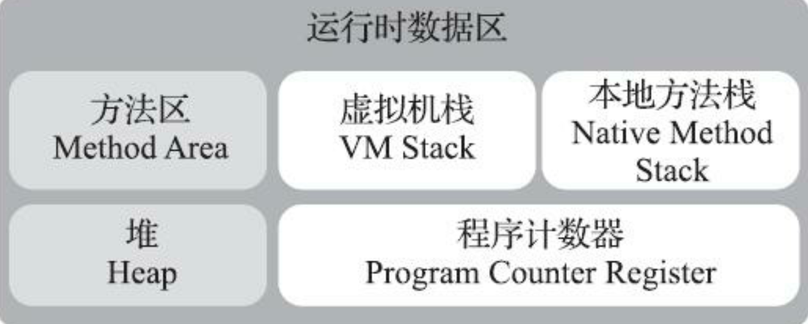
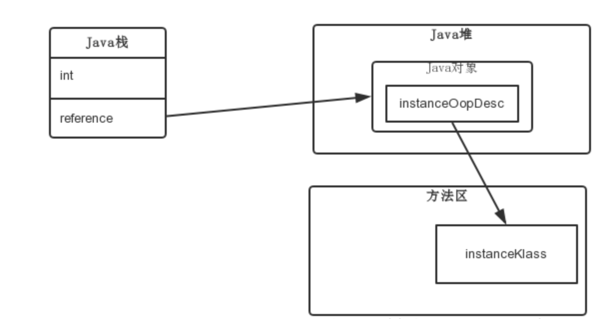

# JVM

1. ### 区域划分

   

   ``线程私有 虚拟机栈，本地方法栈，程序计数器``

   - #### 程序计数器

     ```
     线程私有
     存放当前线程字节码指令，字节码解释器通过改变程序计数器存的值，来选去下一条来执行的指令。
     流程控制，异常，跳转，线程恢复等功能都是通过计数器实现。
     线程私有，独自存储，可以保证多线程切换线程可以回到正常的位置，互不干扰。
     由于存放的是下一条指令地址，所以不会出现 oom
     ```

   - #### 栈

     ```
     虚拟机栈 线程私有，生命周期与线程相同。
     描述的是 java 方法执行的线程内存模型，每个方法执行会同步创建栈帧。
     存储 局部变量表，操作数栈，动态链接，方法出口。
     方法调用到执行完毕，对应一个栈帧在虚拟机栈中入栈到出栈过程
     ```

     ```
     局部变量表
     存放编译期间可知的基本数据类型、对象引用、returnAddress 类型（指向一条字节码指令）
     数据类型在局部变量表中的存储空间以局部变量槽（slot）表示，64 长度的 long 和 double 类型的数据会占用两个变量槽，其余数据类型只占用一个。
     局部变量表所需要的内存空间在编译器完成分配，当进入一个方法时，这个方法需要在栈帧中分配多大的局部变量空间是完全确定的，运行期间不回改变局部变量表的大小（slot 数量）
     ```

     ```
     如果线程请求的栈深度大于虚 拟机所允许的深度，将抛出StackOverflowError异常;
     如果Java虚拟机栈容量可以动态扩展[2]，当栈扩展时无法申请到足够的内存会抛出OutOfMemoryError异常。
     Hotspot 不支持栈扩展,申请成功了就不会 oom
     ```

   - #### 堆

     ```
     线程共享，虚拟机启动创建，存放几乎所有对象实例和数组，物理不连续
     ```

   - #### 方法区（Meta-space）

     ```
     线程共享
     用于存储已被虚拟机加载的类型信息、常量、静态变量、即时编译器编译后的代码缓存等数据
     jdk8 改用了本地内存实现元空间
     和堆一样，不连续存储，可以选择固定大小，可拓展，还可以选择不实现垃圾收集
     也可以进行垃圾回收，主要针对常量池和类型卸载
     低版本的 HotSpot 方法区可能会出现 oom
     ```

   - #### 运行时常量池

     ```
     方法区的一部分，class文件中除了有类似的版本、字段、方法、接口等信息，还有一部分是常量池
     用于存放编译期间生成的各种字面量与符号引用，类加载后存放到方法区的运行时常量池中
     ```

     ```
     动态性
     常量也可以运行时产生，可以在运行时放入
     String.intern()
     ```

     ```
     无法申请内存也会 oom
     ```

   - #### 直接内存

     ```
     会影响动态扩展 oom
     ```

2. ### HotSpot 对象

   1. #### 对象创建（普通对象，不包括数组和Class对象）

      **步骤**

      ```
      new指令
      检测参数能不能在常量池中定位到类的符号引用
      检查类的引用是否已经加载、解析、初始化
      加载类 
      分配内存 
      	取决堆是否是规整的内存空间
      		规整 指针碰撞  【使用过的内存 ｜指针｜ 空闲内存】 指针移动 
      				并发会出问题 
      					使用 cas和 重试机制避免
      					TLAB 内存分配按照线程申请空间 本地缓存区用完了分配新的需要同步锁定
      		不规整 空闲列表 列表存储可用空闲内存地址 查找适合的地址分配 更新列表
      设置对象必要信息 
      	元信息 实例对应类信息 gc分代信息 是否启用偏向锁
      虚拟机创建对象结束
      
      java代码
      class <init>构造
      
      ```

      **new指令 --> 检测参数能不能在常量池中定位到类的符号引用 --> 检查类的引用是否已经加载、解析、初始化**

      ```
      当Java虚拟机遇到一条字节码new指令时
      首先将去检查这个指令的参数是否能在常量池中定位到 一个类的符号引用
      并且检查这个符号引用代表的类是否已被加载、解析和初始化过。
      如果没有，那必须先执行相应的类加载过程
      ```

      ```
      在类加载检查通过后，接下来虚拟机将为新生对象分配内存。
      对象所需内存的大小在类加载完成 后便可完全确定
      为对象分配空间的任务实际上便等同于把一块确定 大小的内存块从Java堆中划分出来
      ```

      - 指针碰撞

        ```
        假设Java堆中内存是绝对规整的
        所有被使用过的内存都被放在一边，空闲的内存被放在另一边
        中间放着一个指针作为分界点的指示器
        那所分配内存就仅仅是把那个指针向空闲空间方向挪动一段与对象大小相等的距离
        这种分配方式称为“指针碰撞”(Bump The Pointer)
        ```

      - 空闲列表

        ```
        如果Java堆中的内存并不是规整的
        已被使用的内存和空闲的内存相互交错在一起，那就没有办法简单地进行指针碰撞了
        虚拟机就必须维护一个列表，记录上哪些内存块是可用的
        在分配的时候从列表中找到一块足够大的空间划分给对象实例，并更新列表上的记录
        这种分配方式称 为“空闲列表”(Free List)
        ```

        

      ```
      选择哪种分配方式由Java堆是否规整决定
      而Java堆是否规整又由所采用 的垃圾收集器是否带有空间压缩整理(Comp act)的能力决定。
      因此，当使用Serial、ParNew等带压缩 整理过程的收集器时，系统采用的分配算法是指针碰撞，既简单又高效;而当使用CM S这种基于清除(Sweep)算法的收集器时，理论上[1]就只能采用较为复杂的空闲列表来分配内存。
      ```

      **创建对象可能出现并发问题**

      ```
      除如何划分可用空间之外，还有另外一个需要考虑的问题:
      对象创建在虚拟机中是非常频繁的行为，即使仅仅修改一个指针所指向的位置
      在并发情况下也并不是线程安全的，可能出现正在给对象 A分配内存
      指针还没来得及修改，对象B又同时使用了原来的指针来分配内存的情况。
      ```

      ```
      解决这个问题 有两种可选方案:
      一种是对分配内存空间的动作进行同步处理——实际上虚拟机是采用CAS配上失败重试的方式保证更新操作的原子性;另外一种是把内存分配的动作按照线程划分在不同的空间之中进行
      每个线程在Java堆中预先分配一小块内存，称为本地线程分配缓冲(Thread Local Allocation Buffer TLAB)
      哪个线程要分配内存，就在哪个线程的本地缓冲区中分配
      只有本地缓冲区用完了，分配新的缓存区时才需要同步锁定
      虚拟机是否使用TLAB，可以通过-XX:+/-UseTLAB参数来 设定。
      ```

      ```
      内存分配完成之后，虚拟机必须将分配到的内存空间(但不包括对象头)都初始化为零值
      如果使用了TLAB的话，这一项工作也可以提前至TLAB分配时顺便进行。
      这步操作保证了对象的实例字段 
      在Java代码中可以不赋初始值就直接使用，使程序能访问到这些字段的数据类型所对应的零值。
      ```

      **对象设置必要信息**

      ```
      接下来，Java虚拟机还要对对象进行必要的设置
      例如这个对象是哪个类的实例、如何才能找到类的元数据信息
      对象的哈希码(实际上对象的哈希码会延后到真正调用O bject ::has hCode()方法时才 计算)、
      对象的GC分代年龄等信息。
      这些信息存放在对象的对象头(Object Header)之中。
      根据虚拟机当前运行状态的不同，如是否启用偏向锁等，对象头会有不同的设置方式。
      ```

      **为了能在多数情况下分配得更快，设计了一个叫作Linear Allocat ion Buffer的分配缓冲区，通过空闲列表拿到一大块分配缓冲区之后，在它里面仍然可以使用指 针碰撞方式来分配。**

   2. #### 对象内存布局

      **对象头(Header)、实例数据(Instance Data)和对齐填充(Padding)。**

      - ##### 对象头(64位 16B)

        ```
        两类信息
        1.存储对象自身的运行时数据  MarkWord 64位 8B
        hashcode gc分代年龄 锁状态 线程持有锁 偏向线程id 偏向时间戳等
        32 64位虚拟机中分别为32位和64位 MarkWord
        2.类型指针 klass 64位 8B
        对象指向想它的类型元数据的指针 通过这个指针来确定改对象是哪个类的实例
        但是查找对象的元数据信息不一定要经过对象本身
        3.如果对象是一个java数组，对象头还必须有一块用于记录数组长度的数据
        因为虚拟机可以通过普通对象的元数据确定对象的大小，数组的额长度不确定，无法确定元数据中的信息推断出数组的大小
        ```

      - ##### 实例数据

        ```
        存储java代码真实数据 定义的字段 无论是从父类继承下来的，还是在子类中定义的字段都必须记录起来
        这部分的存储顺序会 受到虚拟机分配策略参数(-XX:FieldsAllocationSty le参数)和字段在Java源码中定义顺序的影响。 
        HotSpot虚拟机默认的分配顺序为longs/doubles、ints、shorts/chars、bytes/booleans、oops(Ordinary Object Pointers，OOPs)，
        从以上默认的分配策略中可以看到，相同宽度的字段总是被分配到一起存放
        在满足这个前提条件的情况下
        在父类中定义的变量会出现在子类之前
        如果HotSpot虚拟机的 +XX:CompactFields参数值为true(默认就为true)
        那子类之中较窄的变量也允许插入父类变量的空 隙之中，以节省出一点点空间。
        ```

      - ##### 对齐填充

        ```
        需要对齐才存在
        HotSpot 要求对象起始地址必须是 8字节的整数倍
        对象头部分不需要 正好 实例数据不一定 所以这一部分用来填充对齐
        ```

        #### 对象模型

        ```
        HotSpot中采用了OOP-Klass模型，它是描述Java对象实例的模型，它分为两部分：
        
        类被加载到内存时，就被封装成了klass，klass包含类的元数据信息，像类的方法、常量池这些信息都是存在klass里的，你可以认为它是java里面的java.lang.Class对象，记录了类的全部信息；
        OOP（Ordinary Object Pointer）指的是普通对象指针，它包含MarkWord 和元数据指针，MarkWord用来存储当前指针指向的对象运行时的一些状态数据；元数据指针则指向klass,用来告诉你当前指针指向的对象是什么类型，也就是使用哪个类来创建出来的；
        
        那么为何要设计这样一个一分为二的对象模型呢？这是因为HotSopt JVM的设计者不想让每个对象中都含有一个vtable（虚函数表），所以就把对象模型拆成klass和oop，其中oop中不含有任何虚函数，而klass就含有虚函数表，可以进行method dispatch。
        ```

        

        ```
        上图可以看到，通过栈帧中的对象引用reference找到Java堆中的对象，再通过对象的instanceOop中的元数据指针klass来找到方法区中的instanceKlass，从而确定该对象的类型。
        
        下面来分析一下，执行new A()的时候，JVM 做了什么工作。首先，如果这个类没有被加载过，JVM就会进行类的加载，并在JVM内部创建一个instanceKlass对象表示这个类的运行时元数据（相当于Java层的Class对象）。初始化对象的时候（执行invokespecial A::），JVM就会创建一个instanceOopDesc对象表示这个对象的实例，然后进行Mark Word的填充，将元数据指针指向Klass对象，并填充实例变量。
        
        元数据—— instanceKlass 对象会存在元空间（方法区），而对象实例—— instanceOopDesc 会存在Java堆。Java虚拟机栈中会存有这个对象实例的引用。
        ```

        **成员变量重排序**

        ```
        为了提高性能，每个对象的起始地址都对齐于8字节，当封装对象的时候为了高效率，对象字段声明的顺序会被重排序成下列基于字节大小的顺序：
        
        double (8字节) 和 long (8字节)
        int (4字节) 和 float (4字节)
        short (2字节) 和 char (2字节)：char在java中是2个字节。java采用unicode，2个字节（16位）来表示一个字符。
        boolean (1字节) 和 byte (1字节)
        reference引用 (4/8 字节)
        ```

        

   3. #### 对象的访问定位

      **句柄、直接指针**

      - ##### 句柄

        ```
        堆中可能划分出一块内存作为句柄池，reference 存储的就是对象的句柄地址
        句柄包含了对象实例数据与类型数据各自具体的地址信息
        对象被移动只会改变句柄中实例数据指针
        ```

      - #### 直接指针

        ```
        reference 存储的直接就是对象地址
        节省一次指针定位，速度更快
        ```

        

   4. 

   5. 

   6. 

      

      

      

      

      

      

      